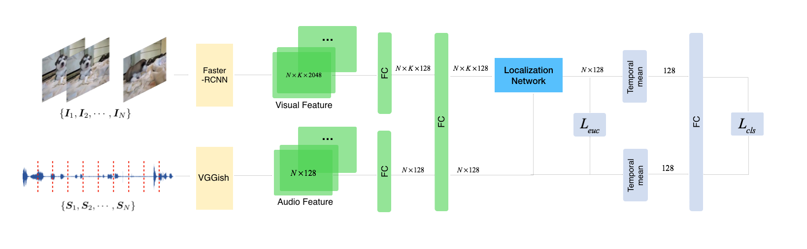

---
#
# Here you can change the text shown in the Home page before the Latest Posts section.
#
# Edit cayman-blog's home layout in _layouts instead if you wanna make some changes
# See: https://jekyllrb.com/docs/themes/#overriding-theme-defaults
#
layout: home
---

## Abstract
Robots are often equipped with microphones and cameras to perceive and understand the audio-visual world. Though visual object detection technology has achieved great success, the detection in other modalities remains unsolved. In this paper, we establish a novel robotic sound-indicated visual object detection framework, and develop a two-stream weakly-supervised deep learning architecture to connect the visual and audio modalities for localizing the sounding object. Also, a dataset is constructed from the AudioSet to validate the proposed method and some promising applications are demonstrated on robotic platforms.

<video id="video" controls="controls" preload="none" width="300" height="300" poster='video---1_cCGK4M_epoch_0_scaled.jpg'>
      <source id="mp4" src="video---1_cCGK4M_epoch_0_scaled.mp4" type="video/mp4">
      
Your user agent does not support the HTML5 Video element.

</video>

<video id="video" controls="controls" preload="none" width="300" height="300" poster='video--d2Z5qR4qQ_epoch_0_scaled.jpg'>
      <source id="mp4" src="video--d2Z5qR4qQ_epoch_0_scaled.mp4" type="video/mp4">
      
Your user agent does not support the HTML5 Video element.

</video>

<video id="video" controls="controls" preload="none" width="300" height="300" poster='video-2dUvMguNro_epoch_0_scaled.jpg'>
      <source id="mp4" src="video-2dUvMguNro_epoch_0_scaled.mp4" type="video/mp4">
      
Your user agent does not support the HTML5 Video element.

</video>

<video id="video" controls="controls" preload="none" width="300" height="300" poster='video-2frhUmysu0_epoch_0_scaled.jpg'>
      <source id="mp4" src="video-2frhUmysu0_epoch_0_scaled.mp4" type="video/mp4">
      
Your user agent does not support the HTML5 Video element.

</video>

<video id="video" controls="controls" preload="none" width="300" height="300" poster='video--a6yUi9a4g_epoch_0_scaled.jpg'>
      <source id="mp4" src="video--a6yUi9a4g_epoch_0_scaled.mp4" type="video/mp4">
      
Your user agent does not support the HTML5 Video element.

</video>

<video id="video" controls="controls" preload="none" width="300" height="300" poster='video-_8E5aDUqas_epoch_0_scaled.jpg'>
      <source id="mp4" src="video-_8E5aDUqas_epoch_0_scaled.mp4" type="video/mp4">
      
Your user agent does not support the HTML5 Video element.

</video>

<video id="video" controls="controls" preload="none" width="300" height="300" poster='video--7jZxfzemI_epoch_0_scaled.jpg'>
      <source id="mp4" src="video--7jZxfzemI_epoch_0_scaled.mp4" type="video/mp4">
      
Your user agent does not support the HTML5 Video element.

</video>

<video id="video" controls="controls" preload="none" width="300" height="300" poster='video--F70LWypIg_epoch_0_scaled.jpg'>
      <source id="mp4" src="video--F70LWypIg_epoch_0_scaled.mp4" type="video/mp4">
      
Your user agent does not support the HTML5 Video element.

</video>

<video id="video" controls="controls" preload="none" width="300" height="300" poster='out_scaled.jpg'>
      <source id="mp4" src="out_scaled.mp4" type="video/mp4">
      
Your user agent does not support the HTML5 Video element.

</video>

<video id="video" controls="controls" preload="none" width="300" height="300" poster='video--7T50tAIrg_epoch_0_scaled.jpg'>
      <source id="mp4" src="video--7T50tAIrg_epoch_0_scaled.mp4" type="video/mp4">
      
Your user agent does not support the HTML5 Video element.

</video>

